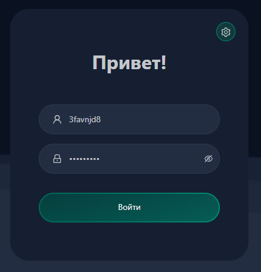
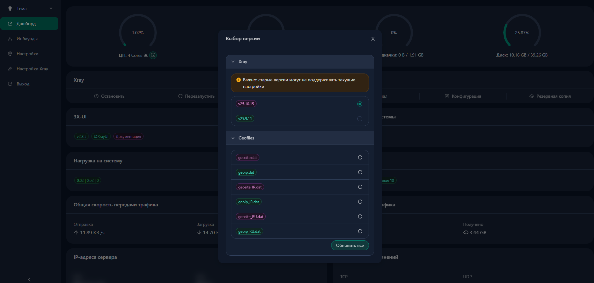
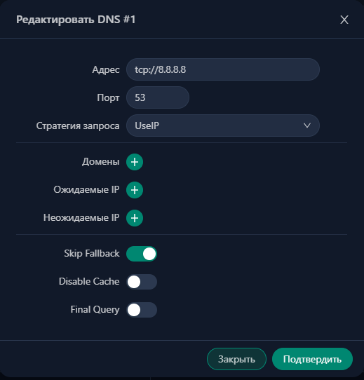

<p align="center">
  <strong>-------></strong> 
  <a href="/README_en_EN.md">English</a> | 
  <a href="/README.md">Русский</a> 
  <strong><-------</strong>
</p>

<p align="center">
  <picture>
    <source media="(prefers-color-scheme: dark)" srcset="./media/logo-dark.png">
    
  </picture>
</p>

---

<div align="center">

[](https://github.com/AnikBeris)
[](/LICENSE.md)
[](https://github.com/AnikBeris)

</div>

<div align="center">
  
</div>


<h1 align="center"> 
статья об установке и настройке 3x-ui + SSL-сертификат
</h1>

<h2 align="center">
> 💡 Материал ориентирован для подготовленых пользователей.
</h2>


* * * * * * * * * * * * * * * * * * 
* * * * * * * * * * * * * * * * * * 


<h2 align="center">
⚠️ Отказ от ответственности ⚠️
</h2>

<p align="center">
  Автор не несёт ответственности за любые возможные последствия использования данного проекта.<br>
  Используйте на свой страх и риск.
</p>

<details align="center"> 
    <summary>⚠️полный текст⚠️</summary>
    
Используйте этот образ на свой страх и риск.

1. Используя его, вы автоматически соглашаетесь с условиями лицензионного соглашения, связанными с ним.

2. Автор не предоставляет никаких гарантий, явных или подразумеваемых, относительно точности, полноты или пригодности этого образа для каких-либо конкретных целей. 
3. Автор не несёт ответственности за любые убытки, включая, помимо прочего, прямые, косвенные, сопутствующие, косвенные или специальные убытки, возникшие из-за использования или невозможности использования этого образа или сопровождающей его документации, даже если о возможности таких убытков было заранее сообщено.

4. Используя этот образ, вы подтверждаете и принимаете на себя все риски, связанные с его применением. Кроме того, вы соглашаетесь, что автор не может быть привлечён к ответственности за какие-либо проблемы или последствия, возникшие в результате его использования.

</details> 

---

<h3 align="center"> 
💖 Поддержите проект 
</h3>

<p align="center"> 
Если этот проект оказался полезным для Вас, вы можете оценить его, поставив звёздочку.:star2: 
</p>

<p align="center">
  <a href="https://pay.cloudtips.ru/p/7249ba98" target="_blank">
    
  </a>
  <a href="https://pay.cloudtips.ru/p/7249ba98" target="_blank">
    
  </a>
</p>


<h4 align="center"> 
Пожертвования горячо приветствуются, какими бы маленькими они ни были, и большое спасибо. 😌 
</h1>

<div align="center">

|  |  |
|-------------:|:-------------|
| **Tether USDT (BEP20)** |`0x22258ea591966e830199d27dea7c542f31ed5dc5`|
| **Bitcoin (BTC)** |`1Dbwq9EP8YpF3SrLgag2EQwGASMSGLADbh`|
| **Ethereum (ERC20)** | `0x22258ea591966e830199d27dea7c542f31ed5dc5`|
| **Binance Smart Chain (BEP20)** | `0x22258ea591966e830199d27dea7c542f31ed5dc5`|
| **Solana (SOL)** | `yYYXsiVTzsvfvsMnBxfxSZEWTGytjAViE2ojf3hbLeF`|
| **Cloud tips** | [cloudtips](https://pay.cloudtips.ru/p/7249ba98) |

</div>

---

<p align="center">
  <sub> Спасибо за Ваше внимание к проекту и за поддержку 💙 </sub>
</p>

---

* * * * * * * * * * * * * * * * * * 
* * * * * * * * * * * * * * * * * * 


## 📚 Содержание

- [Введение](#-введение)


## 🔗 Полезные ссылки


* * * * * * * * * * * * * * * * * * 
* * * * * * * * * * * * * * * * * * 


<h2 align="center">
  <a href="#-содержание"> ⬆️ Наверх </a> 
</h2>

<h1 align="center"> 
Технические требования
</h1>

## 📊 Рекомендуемая ОС

<details> 
    <summary>⚙️ Развернуть описание</summary>
<table>
  <tr>
    <td></td>
    <td>Ubuntu 20.04+</td>
  </tr>
  <tr>
    <td></td>
    <td>Debian 11+</td>
  </tr>
  <tr>
    <td></td>
    <td>CentOS 8+</td>
  </tr>
  <tr>
    <td></td>
    <td>OpenEuler 22.03+</td>
  </tr>
  <tr>
    <td></td>
    <td>Fedora 36+</td>
  </tr>
  <tr>
    <td></td>
    <td>Arch Linux</td>
  </tr>
  <tr>
    <td></td>
    <td>Parch Linux</td>
  </tr>
  <tr>
    <td></td>
    <td>Manjaro</td>
  </tr>
  <tr>
    <td></td>
    <td>Armbian</td>
  </tr>
  <tr>
    <td></td>
    <td>AlmaLinux 8.0+</td>
  </tr>
  <tr>
    <td></td>
    <td>Rocky Linux 8+</td>
  </tr>
  <tr>
    <td></td>
    <td>Oracle Linux 8+</td>
  </tr>
  <tr>
    <td></td>
    <td>OpenSUSE Tumbleweed</td>
  </tr>
  <tr>
    <td></td>
    <td>Amazon Linux 2023</td>
  </tr>
  <tr>
    <td></td>
    <td>Windows x64</td>
  </tr>
</table>


</details> 


## 📊 Поддерживаемые архитектуры и устройства

<details> 
    <summary>⚙️ Развернуть описание</summary>


<table align="center">
  <tr>
    <td colspan="2"> Совместимость с широким спектром архитектур и устройств, обеспечивая гибкость в различных вычислительных средах. Ниже перечислены основные поддерживаемые нами архитектуры: </td>
  </tr>
  <tr>
    <td> amd64 </td>
    <td> Эта распространённая архитектура является стандартом для персональных компьютеров и серверов, обеспечивая беспрепятственную работу большинства современных операционных систем. </td>
  </tr>
  <tr>
    <td> x86 / i386 </td>
    <td> Широко используется в настольных компьютерах и ноутбуках. Архитектура имеет широкую поддержку со стороны многочисленных операционных систем и приложений, включая, помимо прочих, `Windows, macOS и Linux` </td>
  </tr>
  <tr>
    <td> armv8 / arm64 / aarch64 </td>
    <td> Предназначена для современных мобильных и встраиваемых устройств, таких как смартфоны и планшеты. Примеры устройств: `Raspberry Pi 4, Raspberry Pi 3, Raspberry Pi Zero 2/Zero 2 W`, `Orange Pi 3 LTS` и другие </td>
  </tr>
  <tr>
    <td> armv7 / arm / arm32 </td>
    <td> Служит архитектурой для более старых мобильных и встраиваемых устройств. Всё ещё широко используется в таких устройствах, как `Orange Pi Zero LTS, Orange Pi PC Plus, Raspberry Pi 2` и других </td>
  </tr>
  <tr>
    <td> armv6 / arm / arm32 </td>
    <td> Ориентирована на очень старые встраиваемые устройства. Хотя она менее распространена, всё ещё применяется, например, в `Raspberry Pi 1, Raspberry Pi Zero/Zero W` </td>
  </tr>
  <tr>
    <td> armv5 / arm / arm32 </td>
    <td> Более старая архитектура, связанная главным образом с ранними встраиваемыми системами. Сегодня встречается редко, но может использоваться в устаревших устройствах, таких как ранние версии `Raspberry Pi` и некоторые старые смартфоны </td>
  </tr>
  <tr>
    <td> s390x </td>
    <td> Эта архитектура обычно используется в мэйнфреймах `IBM` и обеспечивает высокую производительность и надёжность для корпоративных рабочих нагрузок </td>
  </tr>
</table>

</details> 


## 📊 Поддерживаемые языки

<details> 
    <summary>⚙️ Развернуть описание</summary>

<table>
  <tr>
    <td>🇬🇧</td>
    <td>English</td>
  </tr>
  <tr>
    <td>🇮🇷</td>
    <td>Persian</td>
  </tr>
  <tr>
    <td>🇹🇼</td>
    <td>Traditional Chinese</td>
  </tr>
  <tr>
    <td>🇨🇳</td>
    <td>Simplified Chinese</td>
  </tr>
  <tr>
    <td>🇯🇵</td>
    <td>Japanese</td>
  </tr>
  <tr>
    <td>🇷🇺</td>
    <td>Russian</td>
  </tr>
  <tr>
    <td>🇻🇳</td>
    <td>Vietnamese</td>
  </tr>
  <tr>
    <td>🇪🇸</td>
    <td>Spanish</td>
  </tr>
  <tr>
    <td>🇮🇩</td>
    <td>Indonesian</td>
  </tr>
  <tr>
    <td>🇺🇦</td>
    <td>Ukrainian</td>
  </tr>
  <tr>
    <td>🇹🇷</td>
    <td>Turkish</td>
  </tr>
  <tr>
    <td>🇧🇷</td>
    <td>Português (Brazil)</td>
  </tr>
</table>


</details> 


## 📊 Функции || Особенности

<details> 
    <summary>⚙️ Развернуть описание</summary>

- Мониторинг состояния системы
- Поиск по всем входящим подключениям и клиентам
- Тема: `тёмная /светлая`
- Поддержка нескольких пользователей и мультипротоколов
- Поддержка протоколов: `VMESS, VLESS, Trojan, Shadowsocks, Dokodemo-door, Socks, HTTP, WireGuard`
- Поддержка нативных XTLS-протоколов: `RPRX-Direct, Vision, REALITY`
- Статистика трафика, лимит трафика, ограничение по времени истечения
- Настраиваемые шаблоны конфигурации `Xray`
- Поддержка панели доступа по `HTTPS (собственный домен + SSL-сертификат)`
- Поддержка однокликового запроса `SSL-сертификата` и его автоматического продления
- Для более продвинутых параметров конфигурации см. панель
- Исправленные `API-маршруты` (настройки пользователя создаются через `API`)
- Поддержка изменения конфигураций по различным параметрам, доступным в панели
- Поддержка экспорта/импорта базы данных через панель

</details> 


<h1 align="center">
⚠️ Отказ от ответственности ⚠️
</h2>

<details align="center"> 
    <summary> ⚙️ Развернуть описание </summary>

Используйте этот образ на свой страх и риск. Используя его, вы автоматически соглашаетесь с условиями лицензионного соглашения, связанными с ним.

Автор не предоставляет никаких гарантий, явных или подразумеваемых, относительно точности, полноты или пригодности этого образа для каких-либо конкретных целей. Автор не несёт ответственности за любые убытки, включая, помимо прочего, прямые, косвенные, сопутствующие, косвенные или специальные убытки, возникшие из-за использования или невозможности использования этого образа или сопровождающей его документации, даже если о возможности таких убытков было заранее сообщено.

Используя этот образ, вы подтверждаете и принимаете на себя все риски, связанные с его применением. Кроме того, вы соглашаетесь, что автор не может быть привлечён к ответственности за какие-либо проблемы или последствия, возникшие в результате его использования.

</details> 


<div align="center">
  
</div>


<h2 align="center">
  <a href="#-содержание">⬆️ Наверх</a> 
</h2>


<h1 align="center"> 
SSL-сертификат Cloudflare
</h1>

<div align="center">
  
</div>

Скрипт управления включает встроенную функцию запроса ` SSL-сертификата ` через ` Cloudflare `. Для получения сертификата с помощью этого скрипта вам необходимо:


<details> 
    <summary> ⚙️ Развернуть описание </summary>

- Электронная почта, зарегистрированная в `Cloudflare`
- Global API Key Cloudflare
- Доменное имя должно быть направлено (прописано в DNS) на текущий сервер через `Cloudflare`


## Как получить Global API Key Cloudflare:

1. В терминале выполните команду `x-ui`, затем выберите `Cloudflare SSL Certificate`.

2. Перейдите по ссылке: [Cloudflare API Tokens](https://dash.cloudflare.com/profile/api-tokens)

3. Нажмите `View Global API Key` (см. скриншот ниже):

<div align="center">
  
</div>

4. Возможно, потребуется повторная аутентификация. После этого ключ будет показан (см. скриншот ниже):

<div align="center">
  
</div>


При использовании просто введите свой домен, `email` и `API KEY`. Пример показан ниже:

<div align="center">
  
</div>

</details> 


<div align="center">
  
</div>


<h2 align="center">
  <a href="#-содержание">⬆️ Наверх</a> 
</h2>

<h1 align="center"> 
  <a href="https://anikberis.github.io/vless-config-converter/"target="vless-config-converter"> vless config converter </a> - это конвертер ссылок Vless в готовый конфиг фаил <code>.yml</code> <code>.conf</code>
</h1>

<div align="center">
  
</div>


<details> 
    <summary> ⚙️ Развернуть описание </summary>

<h2 align="center"> Откройте сайт
  <a href="https://anikberis.github.io/vless-config-converter/"target="vless-config-converter"> vless-config-converter </a>
</h2>

<h2>Вкладка <code>Settings</code></h2>

<ol style="font-size: 18px;">
  <li>
    В поле <code>VLESS Link</code> вставьте вашу VLESS-ссылку.
    <br>
    <strong>Пример:</strong>
    <code>vless://UUID@vpn.example.com:443?type=tcp&security=reality&pbk=...&fp=chrome&sni=www.cloudflare.com#My_VLESS_Node</code>
  </li>

  <li>
    В поле <code>Country Flag</code> выберите флаг страны, в которой расположен сервер
  </li>

  <li>
    В поле <code>Proxy Name</code> укажите имя прокси, которое будет использоваться в конфигурационном файле
  </li>

  <li>
    В разделе <code>Config Type</code> выберите <code>Full Config</code>
  </li>

  <li>
    Нажмите кнопку <code>Convert</code> для генерации конфигурации
  </li>
</ol>

<div align="center">
  
</div>

---

<h1 align="center">Скачивание конфигурационного файла</h1>
<h2>Вкладка <code>Result</code></h2>
<ol style="font-size: 18px;">
  <li>
    кнопка <code>Copy</code> - скопировать конфигурацию в буфер обмена
  </li>
  <li>
    кнопка <code>.yml</code> - скачать конфигурацию в формате <code>.yml</code>
  </li>
  <li>
    кнопка <code>.conf</code> - скачать конфигурацию в формате <code>.conf</code>
  </li>
</ol>

<div align="center">
  
</div>

</details> 


<div align="center">
  
</div>


<h2 align="center">
  <a href="#-содержание">⬆️ Наверх</a> 
</h2>


<h1 align="center"> 
Установка 3X-UI
</h1>


# 1. Быстрая установка 3X

<details> 
    <summary> ⚙️ Развернуть описание </summary>


```sh
sudo apt update && sudo apt upgrade -y && \
sudo apt install -y git curl openssl qrencode systemd && \
rm -rf self_signed_certificate.sh && \
curl -O https://raw.githubusercontent.com/AnikBeris/self-signed-certificate/main/self_signed_certificate.sh && \
chmod +x self_signed_certificate.sh && \
bash ./self_signed_certificate.sh

```

</details> 

# 2. Поэтапная установка 3X


<details> 
    <summary> ⚙️ Развернуть описание </summary>

# 📊 Установка необходимых пакетов

1. Обновление системы
Прежде чем начинать установку, убедитесь, что ваша система обновлена. Выполните следующие команды:

```sh
sudo apt update && sudo apt upgrade -y &&
```

2. Установка необходимых пакетов

Убедитесь, что на вашем сервере установлены необходимые пакеты:

```sh
apt-get install wget curl openssl qrencode systemd -y
```


## Установка панели 3X-UI

Для установки панели на сервер запустите выполнение скрипта командой:

```sh
bash <(curl -Ls https://raw.githubusercontent.com/mhsanaei/3x-ui/master/install.sh)
```

Во время установки скрипт задаст вопрос:

```sh
Would you like to customize the Panel Port settings? (If not, a random port will be applied) [y/n]:
```

Отвечаем `y` если хотите установить порт сами, или `n` тогда скрипт установит порт самостоятельно
Не устанавливайте стандартные порты `22, 80, 8080`. Рекомендуем выбрать любой другой, например `8181`


```sh
Username: 3favnjd8

Password: Msdf823Ll

Port: 40608

WebBasePath: vpkPI6ex9ajesDX

Access URL: http://192.168.0.149:40608/vpkPI6ex9ajesDX
```

После выполнения этих шагов установка панели будет завершена и можно подключиться через браузер к панели по пути

```sh
http://IP_адрес_вашего_сервера:порт/WebBasePath(пример: http://192.168.0.10:40608/vpkPI6ex9ajesDX)
```

После ввода адреса в браузере Вы попадете на окно входа в панель, куда необходимо ввести логин и пароль пользователя, которые ранее сообщил скрипт.

<div align="center">
  
</div>

</details> 


<div align="center">
  
</div>


<h1 align="center"> 
Общии настройки
</h1>

## обновление GeoSite GeoIP

<details> 
    <summary> ⚙️ Развернуть описание </summary>

Отрываем понель выбора версий и обновлений

<div align="center">
  
</div>

Обновляем дата файлы `GeoSite` и `GeoIP`

<div align="center">
  
</div>

</details> 


## Включаем подписки

<details> 
    <summary> ⚙️ Развернуть описание </summary>

переходим в `настройки` и включаем подписка

<div align="center">
  
</div>

Когда закончили нажимаем `сохранить` и `перезапуск панели`

# Настройки X-Ray

## Базовые соединения

переходим `настройки X-Ray` -> выбираем `Основные` -> открываем подпуснкт `Базовые соединения`

Выставляем всё, как на картинке

<div align="center">
  
</div>

Когда закончили нажимаем `сохранить` и `перезапуск Xray`

</details> 


## DNS

<details> 
    <summary> ⚙️ Развернуть описание </summary>


переходим `настройки X-Ray` -> выбираем `DNS` -> открываем подпуснкт `DNS`

<div align="center">
  
</div>

Нажимаем `Создать DNS` и по очереди записываем `DNS адреса`

```bash
tcp://8.8.8.8
```

```bash
tcp://1.1.1.1
```

```bash
tcp://9.9.9.9
```

<div align="center">
  
</div>

Когда закончили нажимаем `сохранить` и `перезапуск Xray`

</details> 


<div align="center">
  
</div>


<h1 align="center"> 
Настройка первого подключения
</h1>

## Теперь можно переходить к настройке первого подключения.

Переходим в боковом меню `"Подключения"` -> Нажимаем кнопку `"Добавить подключение"`

<div align="center">
  
</div>


<div align="center">
  
</div>


<h1 align="center"> 📜 Лицензия </h1>
<p align="center">
  <strong> Этот проект распространяется по </strong> 
  <a href="/LICENSE">Apache License</a> 
</p>

---

<h2 align="center"> 
Документация ознакомьтесь с ней 
</h2>

<p align="center">
  <strong>-------></strong> 
  <a href="/README_en_EN.md"> English </a> | 
  <a href="/README.md"> Русский </a> 
  <strong><-------</strong>
</p>


